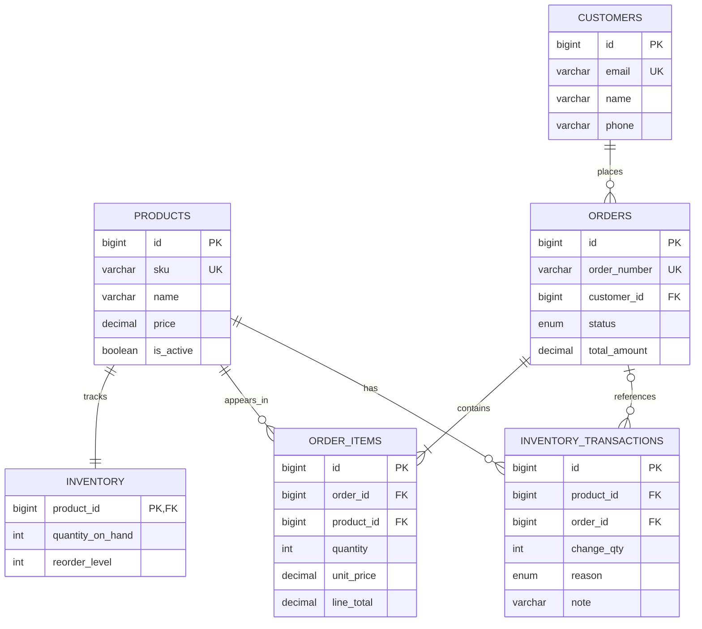

# Database ER diagram

```mermaid
erDiagram
    PRODUCTS ||--|| INVENTORY : tracks
    PRODUCTS ||--o{ ORDER_ITEMS : appears_in
    PRODUCTS ||--o{ INVENTORY_TRANSACTIONS : has
    CUSTOMERS ||--o{ ORDERS : places
    ORDERS ||--|{ ORDER_ITEMS : contains
    ORDERS o|--o{ INVENTORY_TRANSACTIONS : references

    PRODUCTS {
        bigint id PK
        varchar sku UK
        varchar name
        decimal price
        boolean is_active
    }
    INVENTORY {
        bigint product_id PK, FK
        int quantity_on_hand
        int reorder_level
    }
    CUSTOMERS {
        bigint id PK
        varchar email UK
        varchar name
        varchar phone
    }
    ORDERS {
        bigint id PK
        varchar order_number UK
        bigint customer_id FK
        enum status
        decimal total_amount
    }
    ORDER_ITEMS {
        bigint id PK
        bigint order_id FK
        bigint product_id FK
        int quantity
        decimal unit_price
        decimal line_total
    }
    INVENTORY_TRANSACTIONS {
        bigint id PK
        bigint product_id FK
        bigint order_id FK
        int change_qty
        enum reason
        varchar note
    }
```

`inventory_transactions.order_id` is nullable for non-order movements. The inventory balance should equal the sum of `change_qty` for each product.
